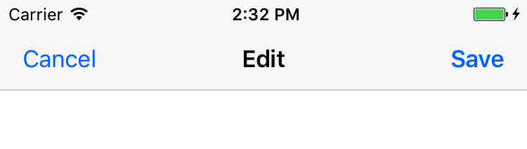

# Tip. UINavigationBar의 사용

저는 UINavigationController를 좋아합니다. Cocoa Touch의 근간과 같은 컨트롤러죠. 이름부터도 iOS의 보편적인 Navigation을 책임지고 있습니다. 

그러다보니 iPhone 사용자들은 UINavigationBar에 참 익숙한데요. 그러다 보니 딱히 `UINavagationController`의 기능이 필요없는 뷰에서도 UINavigationBar에 기능을 넣는 경우가 있습니다. 그런데 그냥 UINavigationBar만을 올리면, 네비게이션바와 스테이터스 바 사이가 붕 뜨는 문제가 있습니다.

오늘은 이것을 해결하는 팁을 소개해 보겠습니다.

### 1. 우선 UINavigationBarDelegate를 연결해 줍니다.  


### 2. ViewController에도 추가해 줍니다.

```swift
class ViewController: UIViewController, UINavigationBarDelegate {
```

### 3. position(for bar:) 메서드로 붙여줍니다.

```swift    
func position(for bar: UIBarPositioning) -> UIBarPosition {
    return UIBarPosition.topAttached
}
```

### 완성!

