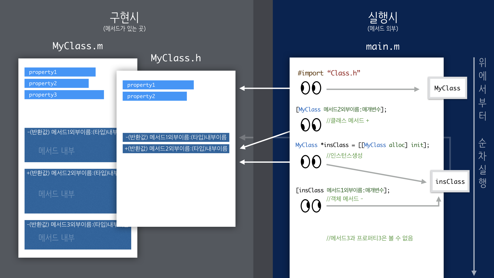

## Objective-C의 메서드, 프로퍼티, 그리고 메인 파일

1. 클래스의 .m 파일에 모든 프로퍼티, 메서드를 구현합니다.
2. 공개할 필요가 있는 정보만 .h 파일로 옮겨옵니다.
3. 메인 파일에서 사용할 클래스를 `#import` 합니다.
4. 클래스 메서드(`+(returntype)`으로 작성된 경우)는 객체를 만들지 않고 클래스에 직접 요청합니다.
5. 인스턴스 메서드(`-(returntype)`으로 작성된 경우)는 객체를 생성한 후 객체에 요청합니다. 객체는 자신의 클래스에 문의하여 메서드를 실행합니다. 자신이 가지고 있지 않은 경우, 부모 클래스를 검색합니다.
6. 공개하지 않은 프로퍼티와 메서드는 메인에서 접근할 수 없습니다.

**[PDF(순서있는버전)](learning/ObjC구조.pdf)**
