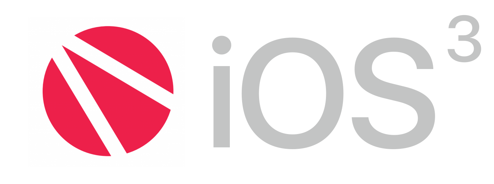

# Jongchan Park 

## About Me
- 현재 - 패스트캠퍼스 iOS School 3기에서 Objective-C를 공부했으며, 5월부터 iOS School 4기에서 조교를 맡으며 Swift를 공부하고 있습니다.
- 과거 - 모바일 앱을 좋아해서 UI/UX 디자이너가 되었지만, 직접 손으로 만들어보고 싶어서 개발자로 전향하게 되었습니다.
- 미래 - Apple이 제공하는 플랫폼의 전문가를 목표로 합니다. 여기서 전문가란 iOS, macOS, watchOS, tvOS 등의 어플리케이션 개발을 튼튼하고 효율적으로 구현할 수 있는 실력을 바탕으로, Apple이 제공하는 HIG 등 UX 지식을 더해 사용하기 쉽고 아름다운 고품질 어플리케이션을 설계하고 제작할 수 있는 사람을 뜻합니다.

## 프로젝트

- [수북 for iOS](https://github.com/draupnir45/SooBook_iOS) : 패스트캠퍼스 iOS 스쿨 최종 결과물입니다. (Objective- C)

- [혼술집 for iOS](https://github.com/draupnir45/honsulzip) : 패스트캠퍼스 iOS 스쿨의 해커톤 결과입니다. (Objective- C)

- [PokéDex for iOS](https://github.com/draupnir45/Poke-dex) : 탭바와 네비바 컨트롤을 연습하면서 만든 포켓몬 도감입니다. (Objective- C)

## Study

### 프로그래밍 일반

- [객체 지향 프로그래밍 기초](learning/Object-Oriented%20Programming.md)
- [Git](learning/AboutGit.md)
- [RAM](learning/RAM.md)
- [한글 인코딩](learning/EncodingHangeul.md)
- [ActiveX, 공인인증서 그리고 기술적 부채](learning/ActiveX&TechnicalDept.md)
- [JSON](learning/JSON.md)

### Swift
0. [스위프트에 대하여](Swift/0_AboutSwift.md)
1. [기본 규칙](Swift/1_LetAndVar.md)
2. [기본 데이터 타입](Swift/2_BasicDataTypes.md)
3. [고급 데이터 타입](Swift/3_WeirdDataTypes.md)
4. [연산자](Swift/4_Operator.md)
5. [흐름 제어하기](Swift/5_ControlFlow.md)

### Objective-C
- [버블 정렬, 머지 정렬, 퀵 정렬(소스코드)](learning/sorts.md)
- [Objective-C 클래스, 메서드, 프로퍼티, 객체 그리고 메인 파일](learning/Objective_C_method_property_and_mainfile.md)
- [Framework Cocoa & Cocoa Touch](learning/AboutCocoa.md)
- [Design Pattern - 프로토콜(Delegate)](learning/FreakinDelegate.md)
- [Design Pattern - 싱글톤](learning/Singleton.md)
- [날짜 표현(NSDate)](learning/NSDate.md)
- [Literal 문법](learning/LiteralSyntaxes.md)
- [우리들의 싱글톤 1 - NSUserDefaults](learning/NSUserDefaults.md)
- [우리들의 싱글톤 2 - NSNotificationCenter](learning/NSNotificationCenter.md)
- [Block 놀이](learning/Block.md)

### Cocoa Touch API (Currently in Objective-C)
- [UIView](learning/UIView.md)
- [UILabel](learning/UILabel.md)
- [UIImageView](learning/UIImageView.md)
- [UIControl](learning/UIControl.md)
- [UIButton](learning/UIButton.md)
- [UITextField](learning/UITextField.md)
- [UIScrollView](learning/UIScrollView.md)
- [UIPageControl](learning/UIPageControl.md)
- [UISwitch](learning/UISwitch.md)
- [UISegmentedControl](learning/UISegmentedControl.md)
- [UITableView](learning/UITableViewLog.md)
- [UIWebView](learning/UIWebView.md)
- [UIBlurEffect](learning/UIBlurEffect.md)

### Storyboard 연습
- [ScrollingStoryBoard](projects/FreakinAutoLayoutPrac) - 오토 레이아웃으로 뷰를 정렬하고 스크롤뷰에 싣는 것을 연습해 보았습니다.

### 잊을만하면 필요할 것만 같은 무언가들
- [JCCustomClasses](projects/JCCustomClasses)
- [무언가들](learning/RememberTheCode.md)

### 연습 및 과제

- [과제] 커스텀 테이블 뷰 과제 ([CustomTableViewCopy](projects/CustomTableViewCopy), 2017. 2. 19)
- [연습] 스토리보드 연습 ([Day1TextChange](projects/Day1TextChange))
- [연습] 클래스 연습 / 전사와 마법사([Day2RolePlayingGame](projects/Day2RolePlayingGame))
- [연습] 클래스 연습 / 술마시기 게임([DringkingGame](projects/DringkingGame))
- [연습] 포켓몬을 오브젝티브로 짜보자! ([PokemonByObjectiveC](projects/PokemonByObjectiveC)) (Pending)
- [연습] 계산기 만들기 ([CalculatorPrac](projects/CalculatorPrac))
- [연습] `UITextField`와 `UIScrollView`를 이용하여 로그인 뷰 만들기 ([LoginPracByLogo](projects/LoginPracByLogo))
- [연습] `UIPageControl`, `UISwitch`와 `UISegmentedControl` ([PageControlTest](projects/PageControlTest))
- [연습] 버블, 머지, 퀵 정렬([SortingPrac](projects/SortingPrac))
- [MyDay](projects/MyDayApp) : 연습을 위해 만들어 본 메모장 겸 일기장입니다.
