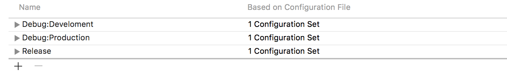

# Configuration 이용하여 개발환경 세팅하기

[CocoaCast](https://cocoacasts.com/)라는 사이트의 [Switching Environments With Configurations](https://cocoacasts.com/switching-environments-with-configurations/)라는 포스트를 참고하여 개발환경을 세팅해봤는데요. 관련해서 핵심이 되는 사항을 정리했습니다.

## 용어 정리
- **Configuration** - 빌드 세팅의 집합체. 기본적으로 Debug와 Release 두 가지가 제공된다.
- **Scheme** - 어떤 컨피겨레이션과 어떤 타겟을 통해 빌드할 것인지를 나타내는 설계도.

## 왜 필요한가?
웹 서비스와 연동하는 클라이언트는 일상적으로 연동 테스트를 수행합니다. 서버 사이드도 개발(테스트+디버그) 용의 서버를 따로 만들게 되고, 클라이언트의 경우 최초에 개발 서버와 먼저 테스트한 후, 실 서버에 내용이 반영되면 실 서버와도 테스트를 해야 합니다. 모든 테스트가 완료되어야 출시가 가능하겠죠? 정리하면 아래와 같습니다.

   - 개발서버 ↔︎ 클라이언트(Debug)
   - 실서버 ↔︎ 클라이언트(Debug)
   - 실서버 ↔︎ 클라이언트(Release, 테스트는 아니고 아카이브용)

가장 간단한 방법은 그냥 여러 개의 URL 스트링을 프로젝트에 넣어 놓고 하나를 주석 처리해놓고 쓰는 방법입니다. 하지만 당연히도 간단한 만큼 번거롭고 번거롭기에 실수가 생길 가능성이 높습니다. 최악의 경우 개발 서버를 바라보고 있는 클라이언트가 앱 스토어에 출시되는 최악의 실수가 벌어질 수도 있습니다.

실수를 방지하고 개발 환경을 쉽게 전환하면서 테스트하기 위해 'Configuaration'을 활용해 보도록 하겠습니다. XCode 프로젝트를 만들면 기본으로 Debug와 Release 이렇게 두 개의 Configuration이 제공됩니다. 말 그대로 하나는 개발과 디버그 용이고 다른 하나는 실제 배포용이죠. 제 목표는 2가지입니다.

1. Debug Configuration을 이용해 개발 서버, 실 서버 테스트를 간단하게 스위칭할 수 있도록 할 것.
2. Archive시 절대 개발 서버의 API를 바라보는 실수가 없도록 할 것.

## 방법
말은 거창하지만 생각보다 어려운 일은 아닙니다.

### 1. Configuration 추가
먼저 프로젝트를 열고, Project → Info 탭 → Configuration 에서 `+` 버튼을 누릅니다. 그리고 'Duplicate "Debug" Configuration'을 선택합니다.

이렇게 하면, 이름만 다른 새로운 Configuration을 만들 수 있습니다. 저는 이렇게 복사한 컨피겨레이션을 실서버 테스트용으로, 기존에 있는 걸 개발서버 테스트용으로 쓰고자 합니다. 그래서 아래와 같이 설정해 주었어요.

### 2. Scheme 추가
