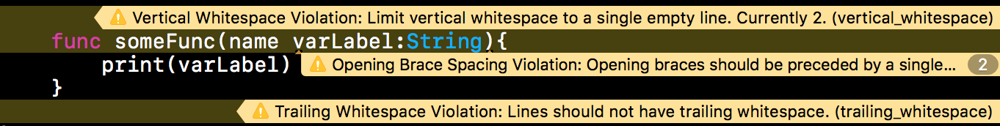
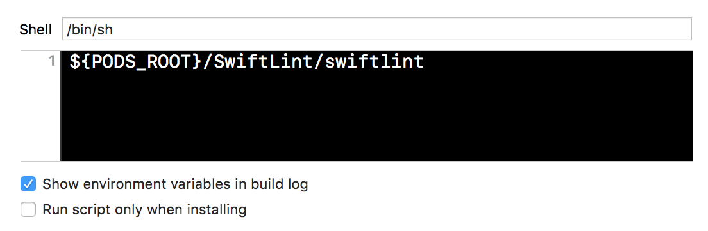

# SwiftLint 사용하기

## 소개

> **Lint**
> 
> lint는 컴퓨터 프로그래밍에서 의심스럽거나, 에러를 발생하기 쉬운 코드에 표시(flag)를 달아 놓는 것을 말한다. 원래는 C 언어에서 사용하던 용어였으나 지금은 다른 언어에서도 일반적으로 사용된다.
> 
> <p align = right> 위키백과, 우리 모두의 백과사전.</p>

  이름에서도 짐작하실 수 있는 것처럼, Swift용의 Lint를 SwiftLint라고 합니다. Xcode는 그 자체로도 꽤나 까다롭게 코드를 검사하고, 불합리한 코드를 걸러냅니다. 예를 들어 `var`로 지정한 변수명에 할당값이 바뀌지 않으면 `let`으로 변경하라는 경고를 띄우는 식이죠. 저는 이런 규칙을 잘 지키는 것을 좋아합니다. 깔끔한 게 좋잖아요. SwiftLint는 거기서 한 걸음 더 나간 규칙입니다. 심지어 공백을 한 칸 이상 띄우는 행동이나 한 파일이 500줄이 넘어가면 다시 생각해보라는 식입니다.

## 적용례
  아래와 같은, 여기저기 조금 어색하지만 굳이 XCode까지 나서서 경고하지는 않는 코드가 있다고 해 봅시다.

```swift
    {...}


    func someFunc(name varLabel:String){
        print(varLabel)
    }
    
```
SwiftLint를 설치하면 저 코드에만 경고가 4개 뜹니다.



이렇게 말이죠. 이유를 정리하면 아래와 같습니다.

```swift
{...}

! 두 칸 이상 여백을 띄웠습니다. 
func someFunc(name varLabel:String){ ! 중괄호 열 때 앞에 여백이 있어야 합니다.
				     ! 콜론에는 우측에 여백이 무조건 있어야 합니다.
    print(varLabel)
}
! 코드 끝에 공백이 있습니다.
```

고치면 아래처럼 되죠.

```swift
{...}

func someFunc(name varLabel: String) {
    print(varLabel)
}

```

## 사용법

SwiftLint를 사용하는 방법은 여러 가지가 있는데요. 일단 최대한 작업 위치에 따른 의존도가 적은 방식인 CocoaPods으로 설명하겠습니다. 

#### 설치
```
pod 'SwiftLint'
```

#### 적용
설치 후에는 Build Phase에 Run Script Phase 를 만들고

위와 같이 설정해주면 됩니다. 

#### 설정하기
그런데 이걸 적용해 놓으면 내 코드 뿐 아니라 워크스페이스 전체 코드, 그러니까 Pods 폴더 안에 있는 남의 코드까지(!!) 막 시비를 겁니다. 심지어 빌드를 안 해주기까지 하죠. (옵셔널을 강제 추출하면  강제 빌드 실패입니다.)
그래서 설정이 필요한데, Git의 .gitignore와 비슷한 방식으로 설정이 가능합니다.

- 우선 설정 파일인 .swiftlint.yml를 만들어줍니다.

	```
	$ vi .swiftlint.yml
	```

- 그리고 이런 식으로 설정하면 됩니다. (이렇게 쓰면 끝에 공백이 있는 줄을 무시하고, Pods 폴더 안을 건드리지 않습니다.)

	```
	disabled_rules:
	  - trailing_whitespace
	
	opt_in_rules:
	  - Pods
	```

- 내용에 대한 참고는 [여기](https://github.com/realm/SwiftLint)서

## 나가면서
이런 규칙을 지키는 것이 뭐 그리 큰 의미가 있나 하고 생각할 수도 있겠지만, 코드도 서로서로 협업하는 작업인만큼 + 아무리 혼자 하는 거라도 과거의 나와 협업할 일도 생길 수 있는 만큼, 하나의 믿을만한 규칙을 적용해놓는 것도 좋은 아이디어 같아요.
