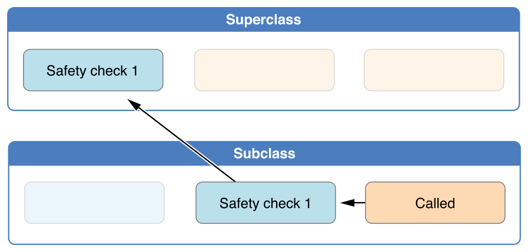

### Two-Phase Initialization
원문: [The Swift Programming Language](https://developer.apple.com/library/content/documentation/Swift/Conceptual/Swift_Programming_Language/Initialization.html)

Swift의 클래스 초기화는 2단계 프로세스입니다. 1단계에서, 각 저장 프로퍼티는 그 저장 프로퍼티를 처음 소개한(선언한) 클래스에 의해 초기값이 지정됩니다. 모든 저장 프로퍼티에 대한 초기 상태가 정해졌을 때 2단계가 시작되며, 각 클래스는 사용할 수 있는 상태가 되기 전에 각자의 저장 프로퍼티를 커스터마이즈할 기회를 얻습니다.

2단계 초기화 프로세스를 사용하면 각 층위의 클래스에게 완벽한 (커스터마이징에의)유연성을 제공하면서도, 초기화 과정을 안전하게 만들 수 있습니다. 2단계 초기화는 프로퍼티 값이 초기화되기 전에 사용되는 것을 방지하는 동시에, 다른 이니셜라이저가 예기치않게 프로퍼티 값을 설정하는 것을 방지합니다.

> **NOTE**
>
> Swift의 2단계 초기화 프로세스는 Objective-C의 초기화와 비슷합니다. 주된 차이점은 1단계에서 Objective-C의 경우 모든 프로퍼티에 제로나 null값을 할당한다는 점입니다(`0`이나 `nil`과 같이). Swift의 초기화 흐름은 더 유연하며, 그 안에서 커스텀 초깃값을 지정할 수 있게 하고, `0`이나 `nil`이 유효한 초깃값이 될 수 없는 타입들에도 대응할 수 있습니다.

Swift’s compiler performs four helpful safety-checks to make sure that two-phase initialization is completed without error:

**Safety check 1**

A designated initializer must ensure that all of the properties introduced by its class are initialized before it delegates up to a superclass initializer.

As mentioned above, the memory for an object is only considered fully initialized once the initial state of all of its stored properties is known. In order for this rule to be satisfied, a designated initializer must make sure that all of its own properties are initialized before it hands off up the chain.

**Safety check 2**

A designated initializer must delegate up to a superclass initializer before assigning a value to an inherited property. If it doesn’t, the new value the designated initializer assigns will be overwritten by the superclass as part of its own initialization.

**Safety check 3**

A convenience initializer must delegate to another initializer before assigning a value to any property (including properties defined by the same class). If it doesn’t, the new value the convenience initializer assigns will be overwritten by its own class’s designated initializer.

**Safety check 4**

An initializer cannot call any instance methods, read the values of any instance properties, or refer to self as a value until after the first phase of initialization is complete.

The class instance is not fully valid until the first phase ends. Properties can only be accessed, and methods can only be called, once the class instance is known to be valid at the end of the first phase.

Here’s how two-phase initialization plays out, based on the four safety checks above:

**Phase 1**

A designated or convenience initializer is called on a class.
Memory for a new instance of that class is allocated. The memory is not yet initialized.
A designated initializer for that class confirms that all stored properties introduced by that class have a value. The memory for these stored properties is now initialized.
The designated initializer hands off to a superclass initializer to perform the same task for its own stored properties.
This continues up the class inheritance chain until the top of the chain is reached.
Once the top of the chain is reached, and the final class in the chain has ensured that all of its stored properties have a value, the instance’s memory is considered to be fully initialized, and phase 1 is complete.

**Phase 2**

Working back down from the top of the chain, each designated initializer in the chain has the option to customize the instance further. Initializers are now able to access self and can modify its properties, call its instance methods, and so on.
Finally, any convenience initializers in the chain have the option to customize the instance and to work with self.

Here’s how phase 1 looks for an initialization call for a hypothetical subclass and superclass:

In this example, initialization begins with a call to a convenience initializer on the subclass. This convenience initializer cannot yet modify any properties. It delegates across to a designated initializer from the same class.

The designated initializer makes sure that all of the subclass’s properties have a value, as per safety check 1. It then calls a designated initializer on its superclass to continue the initialization up the chain.

The superclass’s designated initializer makes sure that all of the superclass properties have a value. There are no further superclasses to initialize, and so no further delegation is needed.

As soon as all properties of the superclass have an initial value, its memory is considered fully initialized, and Phase 1 is complete.

Here’s how phase 2 looks for the same initialization call:

The superclass’s designated initializer now has an opportunity to customize the instance further (although it does not have to).

Once the superclass’s designated initializer is finished, the subclass’s designated initializer can perform additional customization (although again, it does not have to).

Finally, once the subclass’s designated initializer is finished, the convenience initializer that was originally called can perform additional customization.

