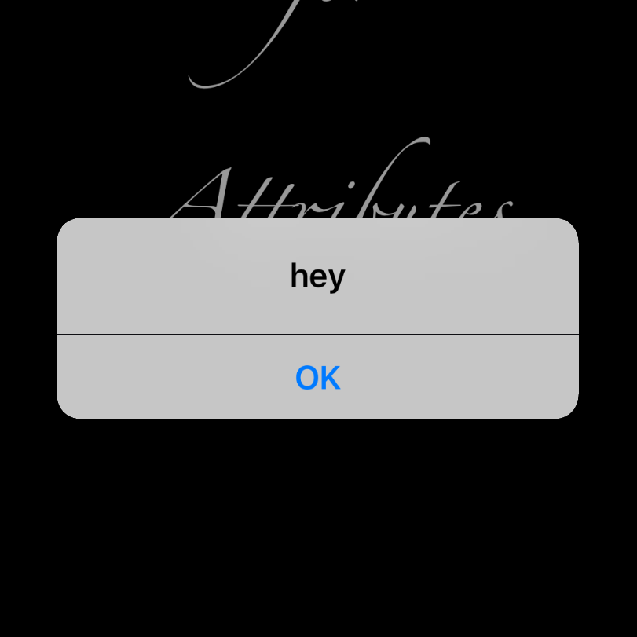

# UIAlertController Made Easy (쉽게 UIAlertController 띄우기)

I love UIAlertController. It's simple, beautiful and well matched to iOS theme. It's also not too difficult to use, but you might need quite an amount of code to implement a fairly simple alert. So I made this UIViewController extension to make implementation just one line, yet not compromise functionalities.

저는 UIAlertController를 되게 좋아합니다. 예쁘고, 기능도 딱 충분할 만큼이어서 복잡하지 않죠. 근데 단 하나. 간단한 거 하나를 띄우려고 해도 너무 많은 코딩이 필요하다는 단점이 있습니다. 뭐 그것도 대단히 긴 줄은 아닙니다만... 어쨌든, 함수 정의의 특성을 이용해서 가장 간단한 얼러트부터 가장 복잡한 얼러트까지 단 한 줄로 해결할 수 있는 extension을 만들어 보았습니다.

(주석에 영어로 썼지만, okHandler를 제공하지 않으면 OK 버튼 타이틀은 무시되고, 자동으로 취소 버튼에 "OK"가 들어갑니다.)

## Code

```swift
extension UIViewController {
  typealias AlertActionHandler = ((UIAlertAction) -> Void)
  
  /// only 'title' is required parameter. you can ignore rest of them
  ///
  /// - Parameters:
  ///   - title: Title string. required.
  ///   - message: Message for alert. 
  ///   - okTitle: Title for confirmation action. If you don't probide 'okHandler', this will be ignored.
  ///   - okHandler: Closure for confirmation action. If it's implemented, alertController will have two alertAction.
  ///   - cancelTitle: Title for cancel/dissmis action. 
  ///   - cancelHandler: Closure for cancel/dissmis action.
  ///   - completion: Closure will be called right after the alertController presented.
  func alert(title: String,
             message: String? = nil,
             okTitle: String = "OK",
             okHandler: AlertActionHandler? = nil,
             cancelTitle: String? = nil,
             cancelHandler: AlertActionHandler? = nil,
             completion: (() -> Void)? = nil) {
    
    let alert: UIAlertController = UIAlertController(title: title, message: message, preferredStyle: .alert)
    
    if let okClosure = okHandler {
      let okAction: UIAlertAction = UIAlertAction(title: okTitle, style: UIAlertActionStyle.default, handler: okClosure)
      alert.addAction(okAction)
      let cancelAction: UIAlertAction = UIAlertAction(title: cancelTitle, style: UIAlertActionStyle.cancel, handler: cancelHandler)
      alert.addAction(cancelAction)
    } else {
    if let cancelTitle = cancelTitle {
    
      let cancelAction: UIAlertAction = UIAlertAction(title: okTitle, style: UIAlertActionStyle.cancel, handler: cancelHandler)
            alert.addAction(cancelAction)
      } else {
      let cancelAction: UIAlertAction = UIAlertAction(title: "OK", style: UIAlertActionStyle.cancel, handler: cancelHandler)
            alert.addAction(cancelAction)
      }

    }
    self.present(alert, animated: true, completion: completion)
  }
}
```

## Usage


```swift
// in UIViewController...

// the simplist case. just title and "OK" Action which does nothing
self.alert(title: "TitleString") 

// the most complicated case. You can customize title, message, OK action title, OK handler, cancel action title, cancel handler and completion hander.
self.alert(
  title: "Title", 
  message: "message to user", 
  okTitle: "OK", 
  okHandler: { alertAction in
    //Closure on user select "OK"
}, 
  cancelTitle: "Cancel", 
  cancelHandler: { alertAction in
    //Closure on user select "Cancel"
}, 
  completion: {
    //Closure on present
})
```

## Screenshot
`self.alert(title: "hey"`


