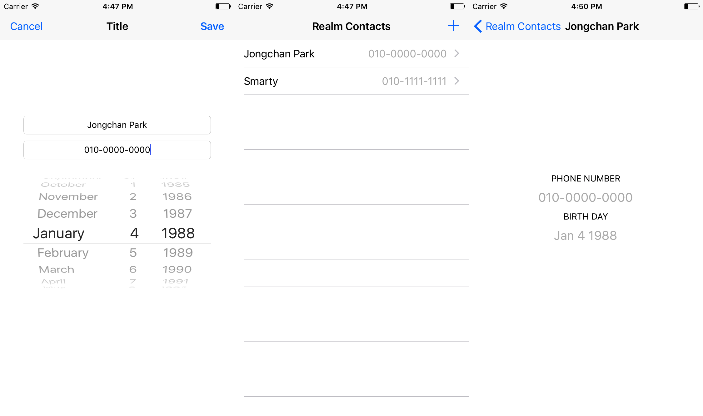

# Realm 모바일 데이터베이스

Realm을 이용해서 간단하게 주소록을 만들어 봤습니다.
(Dependancy Manager는 Carthage를 사용했습니다. 설정법은 [여기](https://github.com/draupnir45/i.jongchan.park/blob/master/learning/Carthage_usage.md))

## ScreenShots


## 구현부

### 1.Object 서브클래스 만들기
Realm을 프로젝트에 추가하면 자동으로 `Object`라는 클래스를 사용할 수 있게 됩니다. 굉장히 당당한 이름이네요... `NSObject`가 마치 외부 라이브러리처럼 보이게 하는 Realm의 위엄!

```swift
import Realm
import RealmSwift

class Contact: Object {
    
    ///'dynamic var'로 프로퍼티를 설정해 줍니다.
    dynamic var personID: Int = 0
    dynamic var name: String = ""
    dynamic var phoneNumeber: String = ""
    dynamic var birthDay: Date?
    
    ///새로운 PrimaryKey를 만들어 할당해 줍니다.
    func createNewPrimaryKey() {
        self.personID = UserDefaults.standard.integer(forKey: "primary_key") + 1
        UserDefaults.standard.set(self.personID, forKey: "primary_key")
    }
    
    ///Primary Key를 등록해 줍니다.
    override static func primaryKey() -> String? {
        return "personID"
    }
}
```

### 2. Object 추가하기
이후에는 놀랍도록 그냥 클래스 인스턴스처럼 사용할 수 있습니다.
생성 이후에는 `realm.write(block: (() throws -> Void)`를 이용해서 Realm에 변경사항을 저장할 수 있습니다.

```swift
let contact: Contact = Contact()
contact.name = nameTextField.text!
contact.phoneNumeber = phoneNumberTextField.text!
contact.birthDay = datePickerForBirthDay.date
contact.createNewPrimaryKey()

//다른 스레드 작동을 염두에 두고 새로 생성
let realm: Realm = try! Realm() 
try! realm.write {
    realm.add(item)
}
```

### 3. Object 불러오기
`primaryKey`를 설정해 놓았으니 그걸로 찾아올 수도 있고, filter를 이용할 수도 있습니다.

```swift
//primaryKey를 사용하는 방법! 옵저빙 프로퍼티에 걸어 보았습니다.
var displayingItemIndex: Int! {
    didSet {
        self.displyingItem = realm
            .object(ofType: Contact.self,
                    forPrimaryKey: displayingItemIndex)
    }
}

//filter를 이용하는 방법! 올린 샘플 프로젝트에는 해당하지 않습니다.
let displyingItems = realm.objects(Contact.self)
			  .filter(format: "age > %d", filteringAge)
```

