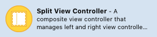
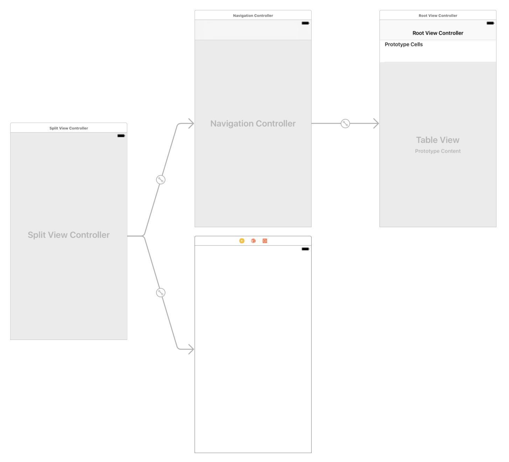
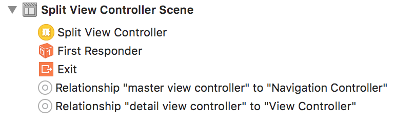
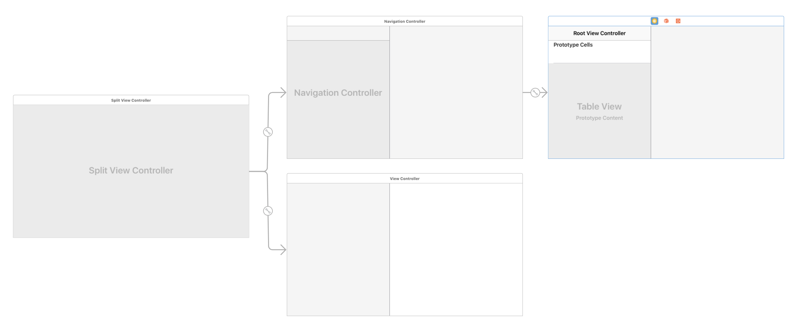
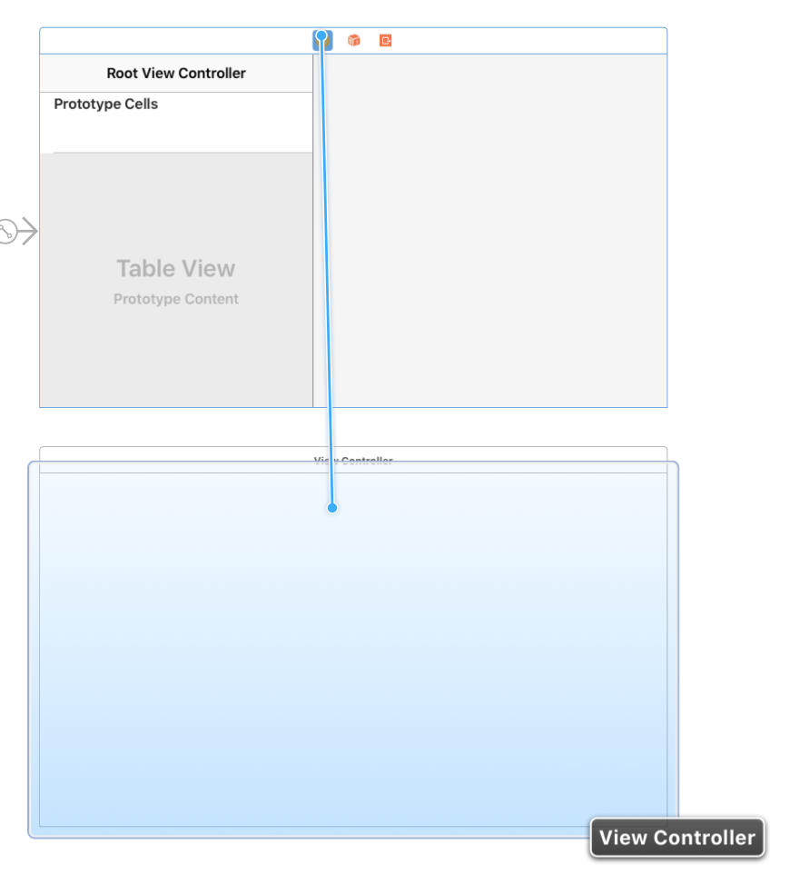
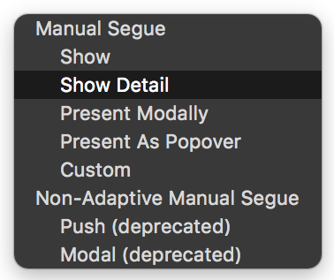
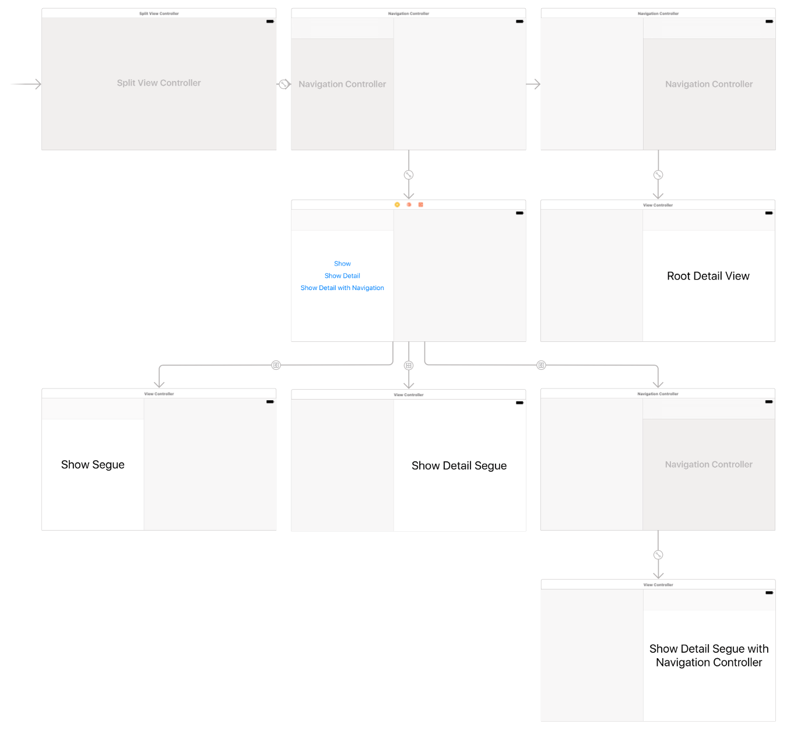

# 기본 Split View Controller 활용

iPad는 애플이 가진 개인 컴퓨팅의 철학을 담은 프로덕트입니다. 아이폰보다 먼저 구상했다고도 합니다. 하지만 실제로 먼저 출시된 것은 아시다시피 아이폰이고, UIKit은 그에 맞춰 진화해왔습니다. 그 중 가장 기본적인 것이 바로 `UINavigationController`와 Show의 결합입니다. 

작은 아이폰 사이즈에서 가장 합리적으로 정보를 표현할 수 있도록 고민한 결과물인 것이죠.

그런데 아이패드가 출시되면서 이 부분에 조금 보강이 필요해졌습니다. 그 보강을 한 것이 바로 예전에 아이패드 전용 버전으로 알려졌던 	iOS 3.2입니다. 이 당시에 추가된 것이 바로 `UISplitViewController`입니다.

이번 포스트에서는 SplitView의 side-by-side 모드라고 알려진, 왼쪽에 메뉴에 해당하는 것들을 담는 좁은 뷰를 두고 오른쪽에는 디테일한 정보를 담는 뷰를 위치시키는 세팅을 간략하게 정리해 보겠습니다.

생각보다 간단합니다만, 어떤 세그로부터 오느냐에 따라 행동이 달라지는 특성에 대해 익숙해져 있어야 받아들이기 쉬운 면이 있습니다.

우선 순서대로 알아볼까요?

1. 위처럼 생긴 템플릿을 찾아서 스토리보드 화면에 던지면, 아래와 같은 형태가 표시됩니다. 

(스플릿 뷰 컨트롤러에 Initial View Controller 지정하시는 거 잊지 마세요!)

눈여겨봐야될 것은 스플릿 뷰로부터 나온 두 관계 세그(Relationship Segue)입니다.

여기서 보듯, 스플릿 뷰컨트롤러에는 두 가지 뷰 컨트롤러가 필요합니다. 바로 'Master'와 'Detail'이죠.

- Master View Controller : 'Master'는 기본이 아예 테이블 뷰로 지정이 되어 있네요! 목록을 표시하는 아이입니다
- Detail View Controller : 'Detail'은 말그대로, 자세한(보통 상대적으로 큰 공간을 필요로 하는) 정보를 상대적으로 넓은 우측에 띄워주는 녀석입니다.

이걸 좀 더 쉽게 볼 수 있는 방법이 있으니, iPad나 iPhone의 플러스 기종을 옆으로 뉘어 보는 형태로 미리보기를 하는 것입니다.

아래와 같이 보입니다.

2. 이제 새로운 뷰를 만들어서 붙일 텐데요. 세그는 `show`와 `show detail`을 씁니다.
	- `show` : 지금 자리에 밀고(push)들어옵니다. [(어트리뷰트 인스펙터)](images/show.png)
	- `show detail` : master에 있다면 detail 자리로 보냅니다. [(어트리뷰트 인스펙터)](images/showDetail.png)

말인즉슨, `show detail` 만 잘 알고 있어도 된다는 거죠! master에서 가든 detail에서 가든, 상황이 바뀌는 건 show detail을 썼을 때 뿐입니다. detail이 출발점인데 show detail을 쓰면 그냥 show와 동일한 효과를 지닙니다.

> NOTE
> 
> 스플릿 뷰에서 세그를 통해 컨트롤하는 것은 Navigation Controller에 묶인 뷰들이 자동으로 스택 형식으로 쌓이면서 상단에 네비게이션 바를 갖게 되는 것과 아주 유사합니다. 세그의 출발점에 있는 뷰가 담겨 있는 컨테이너 뷰 컨트롤러가 무엇인지, 또 그 세그의 속성이 무엇인지에 따라서, 목적지(destination)이 되는 뷰의 행동과 모양을 자동으로 결정해주는 것이죠.

3. 입맛에 따라 Navigation Controller를 추가해 주셔야 합니다. 예를 들어 master에서 detail로 움직일 때에는 'show'가 되는 것이 아니라 detail에 있는 뷰를 'replace'하는 거에요. 따라서 기존 마스터에 있는 뷰의 컨트롤러가 종속되어 있는 네비게이션 컨트롤러를 사용하지 못합니다. (그냥 새로 넣어 주시는게 속편해요.)

아래는 각 상황별 예시를 담은 스토리보드입니다.

전 좋은 iOS 앱일수록 의도에 정확하게 맞게 프레임워크를 사용하고, 그에 따라 유니버설 앱을 지원하면서도 사용성을 해치지 않는 구조를 만들어 낼 수 있다고 믿습니다. 기본을 아는 것은 중요하죠.

도움이 되셨기를 바라요ㅎㅎ