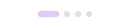

# 손에 따라 애니메이션처럼 움직이는 커스텀 페이지 인디케이터 (Page Indicator)

UIPageControl도 좋지만, 지겨울 때가 있죠. 그리고 굳이 그 작은 걸 눌러서 페이지 이동을 할 필요가 있나 싶기도 하구요. 간단한 커스텀 인디케이터를 만들어 보았습니다.

## 결과물



## 환경
- iOS 9.0 +
- Swift 4.0
- SnapKit

## 개요

UIScrollViewdelegate의 scrollViewDidScroll(_:)을 이용하면, 스크롤되는 도중의 모든 contentOffset을 감시할 수 있습니다. 그 모든 타이밍에 페이지 인디케이터를 업데이트해주면, 나머지는 알아서 애니메이션처럼 보입니다. (이미 충분히 세부적인 contentOffset의 변화를 캐치할 수 있기 때문에, 애니메이션 함수는 필요가 없습니다.)

## Code

### scrollViewDidScroll(_:)
- 현재의 포지션을 전체 페이지 대비해서 계산합니다. 예를 들어 0.7라는 숫자는 0번 뷰에서 1번 뷰까지 70% 스크롤된 상태란 뜻입니다.
(예제 코드는 이것과는 조금 다릅니다. 그 코드는 상단 스크롤 뷰가 무한스크롤이어서 contentOffset을 좀 특이하게 쓰고 있었기 때문입니다.)

```swift
var currentPosition = (scrollView.contentOffset.x / width)
```

그러면 이 포지션을 가지고 중간 단계를 표현해주기만 하면 자연스럽게 부드러운 애니메이션으로 보이게 될 겁니다. 해당 코드를 볼까요?

```swift
  var currentPosition: Double = 0.0 {
    didSet {
      updateAppearance()
    }
  }
  
  func updateAppearance() {
  
  // 모든 애니메이션에서는 인접한 두 개의 점의 모양이 바뀝니다. 예를 들어 포지션이 currentPosition이 1.5라면 2번째 점과 3번째 점을 조정해야 하겠죠.
  
  // 첫번째 점
  let firstIndex = Int(currentProgress)
  let firstDot = dots[firstIndex]
  
  // 두번째 점
  let secondIndex = (firstIndex + 1) % numberOfSteps
  let secondDot = dots[secondIndex]
  
  // 첫 번째 점으로부터 두 번째 점까지 사이에서 어느 정도 비율에 멈춰 있는가를 계산합니다.
  let ratio = currentProgress - Double(firstIndex)
  
  // 선택된 점의 width는 20.0이고 선택되지 않은 뷰의 width는 6.0입니다. 
  // 예를 들어 ratio가 0.3이라면, 첫번째 점의 가로 크기는 14.0 * 0.7 + 6.0가 됩니다.
  firstDot.snp.updateConstraints { make in
    make.width.equalTo((14.0 * (1.0 - ratio)) + 6.0)
  }
  
  // 위와 동일한 계산이지만, ratio가 다릅니다. 
  // 예를 들어 ratio가 0.3이라면, 두번째 점의 가로 크기는 14.0 * 0.3 + 6.0가 됩니다.
  secondDot.snp.updateConstraints { make in
    make.width.equalTo((14.0 * (ratio)) + 6.0)
  }
  
  // 오토 레이아웃으로 수정했기 때문에, 반영해 줍니다.
  layoutIfNeeded()
}
```

## 예제
