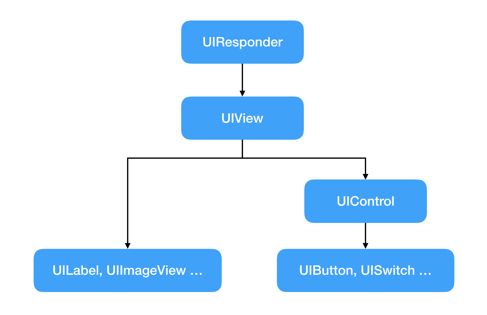

# UIView에서 touchUpInside 받아오기

- iOS 11.2
- Swift 4.0

## 개요
모든 뷰의 최상단 부모 클래스인 UIView는 UIResponder를 상속 받은 클래스입니다. '응답하는 클래스'라는 거죠. UIResponder는 터치를 감지하고, 각 터치 유형에 따라 적절한 메서드를 호출해 줍니다.

```objc
@interface UIView : UIResponder <...>
```

UIButton과 같은 UIControl 종류는 모두 UIView를 상속받습니다. 아래와 같은 구조입니다.



여기서 UIControl은, UIResponder가 전달해 준 'UIEvent'를 'UIControlEvent'로 바꾸는 역할을 해 줍니다.

```swift
public struct UIControlEvents : OptionSet {

    public init(rawValue: UInt)

    
    public static var touchDown: UIControlEvents { get } // on all touch downs

    public static var touchDownRepeat: UIControlEvents { get } // on multiple touchdowns (tap count > 1)

    ...

    public static var touchUpInside: UIControlEvents { get }

    public static var touchUpOutside: UIControlEvents { get }

    ...
}
```

그리고 각 UIControlEvent에 따라 특정 오브젝트의 특정 메서드를 호출할 수 있게 해 주죠. addTarget(_:, action:, for:)입니다.

```swift
open func addTarget(_ target: Any?, action: Selector, for controlEvents: UIControlEvents)
```

이번에는 UIView만 가지고 touchUpInside를 캐치할 수 있고, 셀렉터로 메시지를 호출하는 대신 @escaping 클로저를 가지고 버튼처럼 쓸 수 있는 커스텀 뷰를 만들어 보겠습니다. 

(예제는 [FlameKit](https://github.com/draupnir45/FlameKit)이라는 코코아팟의 FlameButton을 보시면 되겠습니다.)

## UIResponder 사용하기

UIResponder는 Application으로부터 event들을 받을 때마다 해당하는 이벤트가 발생했음을 알리는 메서드를 호출해 줍니다. 오늘은 touchUpInside를 구현해볼 거기 때문에, 아래의 3가지 메서드를 보겠습니다.

```swift
open func touchesBegan(_ touches: Set<UITouch>, with event: UIEvent?)

open func touchesMoved(_ touches: Set<UITouch>, with event: UIEvent?)

open func touchesEnded(_ touches: Set<UITouch>, with event: UIEvent?)

```
