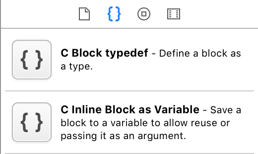

# Block

```objc
typedef NSString * (^MyBlockType)(NSInteger, NSString *);
    
MyBlockType myBlockInstance = ^(NSInteger intParam, NSString *textParam) {
    return [NSString stringWithFormat:@"%@ : %ld",textParam,(long)intParam];
};
    
NSLog(@"%@",myBlockInstance(4, @"hi"));
```

귀찮으니

### 가져다 쓰자!

