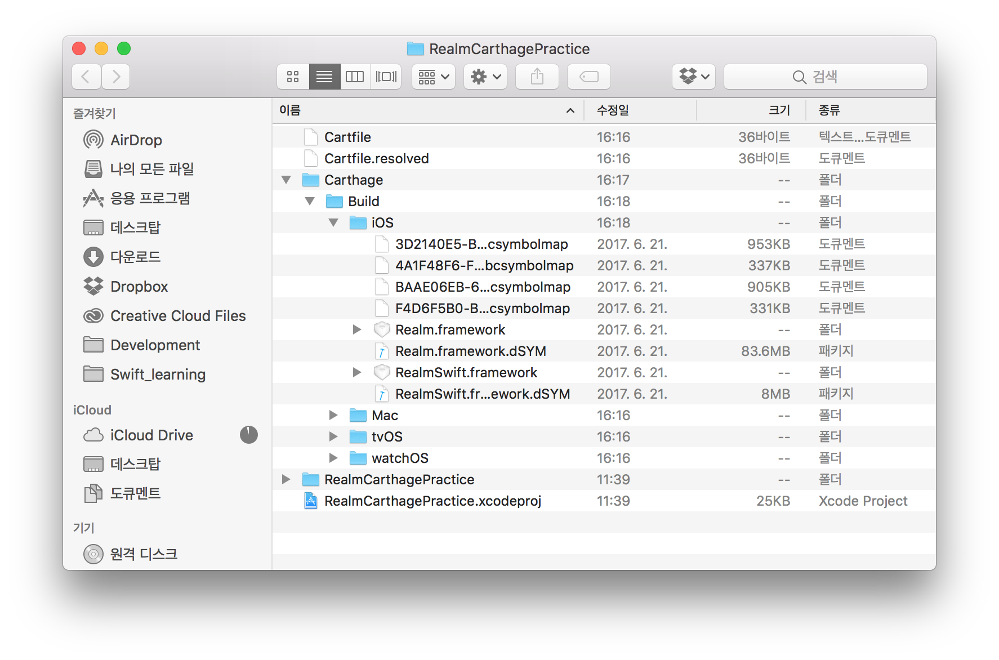
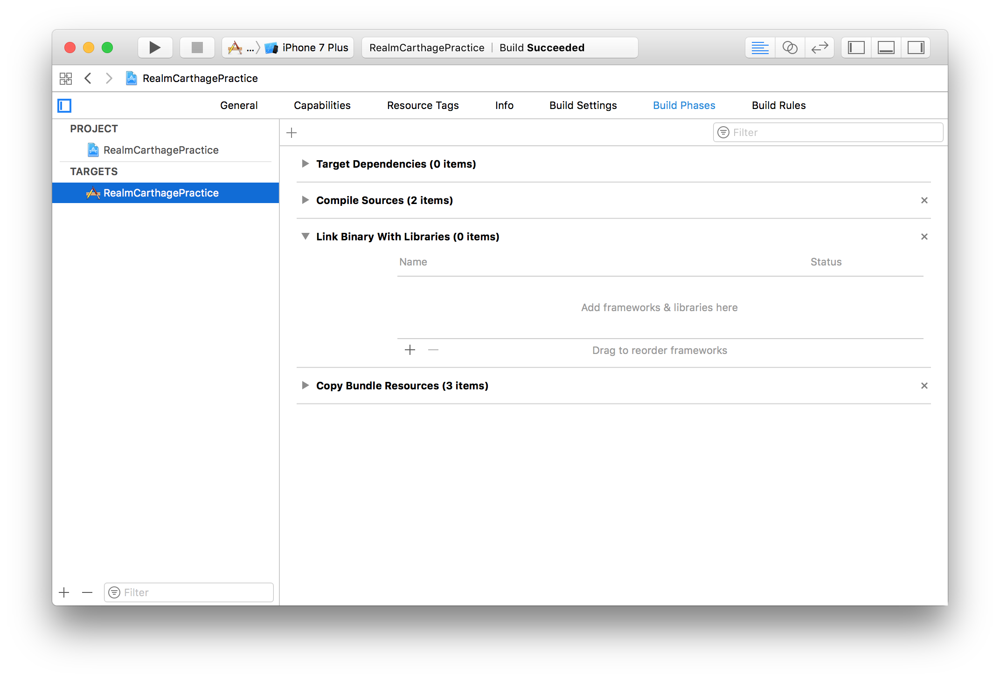
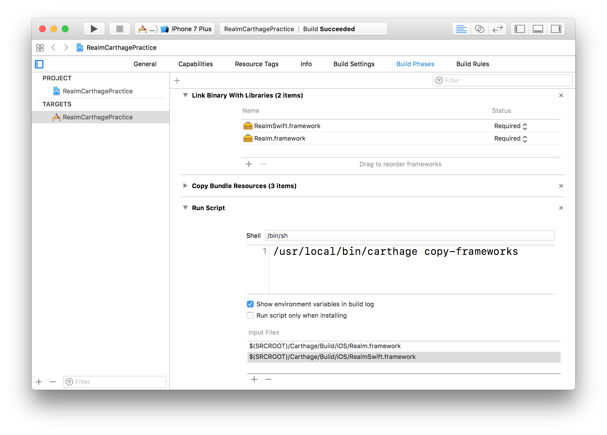

# 카르타고(Carthage) 활용법

6월 28일, FastCampus에서 2기 기수강 개발자인 이봉원님(GiftBot)님의 특강이 진행되었습니다. 크게 두 가지 부분에 대해 강의 진행하셨는데요. 첫 번째가 CocoaPods 등 디펜던시 매니저 관련 활용법이고, 두 번째는 요즘이라기엔 뭐하고 계속 핫한 Realm에 대한 활용법이었습니다.

두 가지 다 내용이 좋아서. 인상적인 것을 정리놓으려고 합니다.

## 카르타고?

카르타고는 이번에 처음 알게 된 디펜던시 매니저인데요. 코코아팟과 동일한 목적을 위해 사용하지만, 컴파일 타이밍이 다릅니다. 프로젝트에 코드로 추가하는 것이 아니라 컴파일된 바이너리를 등록해서 쓰는 방식인데요. 이 방식을 통해 수정사항이 발생할 리가 거의 없는 외부 라이브러리 컴파일을 내 프로젝트 수정할 때마다 매번 컴파일하는 비효율을 피할 수 있습니다.

- [공식 GitHub](https://github.com/Carthage/Carthage)

## 활용법

### 1. 설치

카르타고 설치는 몇 가지 경로로 할 수 있는데요.
혹시 Mac에 Homebrew가 이미 설치되어 있다면 제일 쉽습니가. 터미널에 가서

```
$ brew update
```

이렇게 업데이트만 한 번 해주시고,

```
$ brew install carthage
```

위 명령어를 실행해 주시면 설치가 됩니다. 혹 설치가 되어 있지 않고, 또 '그런 거' 싫어하시는 분은 이 [링크](https://github.com/Carthage/Carthage/releases)에서 `.pkg` 파일을 받아서 실행해주시면 됩니다. 


### 2. Cartfile

CocoaPods의 Podfile처럼, Cartfile이라는 것을 만들어서 활용할 라이브러리들을 넣어 줍니다. 단 pod init처럼 만들어주는 것은 아니고, 그냥 vim으로 만들어 주시면 됩니다. 혹시 vim을 모르신다면 [이곳](https://www.joinc.co.kr/w/Site/Vim)에서 배우셔요.

터미널을 이용해 적용하고자 하는 폴더까지 간 후,

```
$ vi Cartfile
```

위처럼 입력해서 vim을 열어 만들어 줍니다. 내용은 그냥

```
github "realm/realm-cocoa" ~> 2.8.3
```

이거 한 줄이면 끝납니다. 여기는 코코아팟보다 쉽더라구요. 물론 더 다른 설정이 있는데 제가 모르는 걸수도 있겠지만...

### 3. 업데이트

Cartfile이 준비됐으면

```
$ carthage update
```

를 해 주시면 되는데요. 플랫폼이나 라이브러리를 특정해서 아래처럼 해줄 수도 있습니다.

```
$ carthage update --platform iOS
$ carthage update realm-cocoa
```

### 4. 프로젝트에 적용

3번까지 마치면 프로젝트 폴더에 아래와 같이 프레임워크가 들어오는데요.

이걸 이용해서 프로젝트에 추가해 줄 텐데요. 우선 프로젝트를 열고 Build Phase 설정을 찾아줍니다.


여기까지 왔으면 아래를 그대로 따라하세요.

1. Link Binary With Libraries에 `.framwork` 파일을 추가해 줍니다.
2. 상단의 + 버튼을 눌러 'Run Script'를 추가해 줍니다.
3. 아래처럼 '/usr/local/bin/carthage copy-frameworks'라는 문구를 입력해주고,
4. Input Files에 '$(SRCROOT)/Carthage/Build/iOS/[프레임워크 파일명].framework' 을 추가해 주세요.

완성된 모습은 아래와 같습니다.



### 5. Import

모든 준비가 끝났습니다. 한번 빌드해주시고, 그냥 쓰시면 됩니다!

```swift
import RealmSwift
```

임포트가 자동완성됩니다.


## 마치면서

코코아팟보다 조금 초기 설정이 복잡하긴 하지만, 규모가 큰 오픈소스는 이렇게 쓰면 좋을 것 같습니다. 매번 컴파일하는 시간이 아깝잖아요?ㅜㅜ