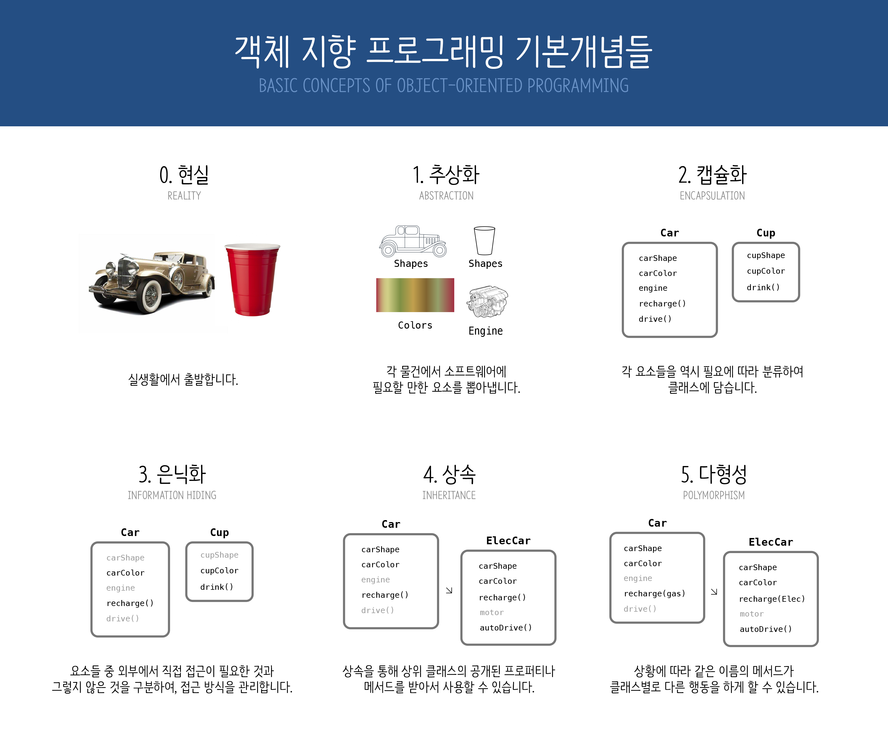

#객체 지향 프로그래밍의 핵심 개념
###간단히 그림으로 정리해보았습니다.


(여기서부터 개념을 정리하겠습니다. Objective-C에서 쓰이는 용어를 기본으로 합니다.)


##추상화

추상화란, 객체의 공통된 속성과 행위를 추출하는 것이다. 

어떤 대상에 대하여 해결하고자 하는 문제에 관련해서 공통적인 정보만 추출해내는 것이다. 그것을 통해서 하나의 클래스를 정의하고, 객체는 그 클래스에 기반하여 만들어진다.

추상화를 잘 하게 되면 코드를 이해하기가 쉬워진다. 뿐만 아니라 기능을 추가하거나 고치는 것도 더 수월해진다. 실제 생활과 잘 닮아 있기 때문이다. '음식'이라고 붙은 객체로 '공격' 이라는 행동을 하려는 사람은 없는 것과 같은 맥락으로 이해할 수 있다.

##캡슐화

캡슐화란 추상화된 개념들을 필요에 따라 클래스에 담아 정리하는 것을 말한다. 이렇게 정리된 클래스로 만들어진 객체들이 서로 행동을 주고받게 함으로써 사람이 알아보기 쉽고 설계하기도 쉽고 수정하기도 쉽게 된다.
클래스에 저장된 개념들 중 객체의 속성이나 특징에 해당하는 것은 '프로퍼티```@property```'로 불리고, 행동에 해당하는 것은 '메서드```-(returnType)methodName:(id)parameter;```'로 불린다.


##은닉화

캡슐화된 요소들 중 외부에서 직접 접근이 필요한 것들 이외에는 공개하지 않고 숨겨 좋고, 제한된 방법으로만 접근하게 하는 것이 은닉화다. 은닉하고 싶은 것들은 ```.m```파일에만 작성하고, 필요시에만 ```.h```에 공개하도록 한다.


##상속

각 객체는 자신의 클래스로 만들어지고, 클래스는 트리 형식으로 특성을 상속받는다. 모든 클래스(로부터 만들어진 객체)는 최상단 루트 클래스(NSObject)로부터 그 특성을 물려받았다. 중간중간 분화되면서 어떤 것은 뷰컨트롤러로, 어떤 것은 뷰로, 또는 개발자가 정의한 완전히 새로운 무엇인가로 상속을 받으면서, 점점 각자의 역할에 맞게 변해 간다.

이것의 장점은 부모가 하는 행동은 기본적으로 자식 클래스가(덮어쓰지 않는 한) 모두 물려받는다는 점이다. (덮어쓰거나 수정하면 다형성 지원이 가능해진다) 대표적으로 initialization 같이, 모든 클래스에게 필요한 것은 루트 클래스가 가지고 있고, 각자 그 행동을 물려받아 나름대로 변형해서 지원한다.


##다형성

다형성이란 간단하게 말하면 같은 함수명에 대해 다른 함수가 동작할 수 있도록 하는 특성이다.
예를 들어 부모 클래스에서 받은 함수의 내용을 수정한다든가, 아니면 서로 다른 클래스가 같은 함수명을 가지는 경우 등이다. 이를 통해, 여러 행위 주체가 같은 동사로 표현되는 행위를 하면서 결과가 서로 다르게 나오는 상황도 훨씬 직관적으로 구현할 수 있다. 예를 들어 남성 객체와 여성 객체가 있다면, 둘 다 화장실을 가겠지만, 서로 도착하는 행선지는 다를 것이다. 이것을 다형성이 지원되지 않는다면

```
[male1 goToMaleBathRoom];
[female1 goToFemaleBathRoom]; 
```

이라고 해주어야 하겠지만, 다형성이라면 간단하게

```
[male2 goToBathRoom];
[female2 goToBathRoom];
```

이렇게 해주면 된다. 큰 차이가 없어 보이지만, 이런 경우가 있다.
만약 남성(Male)과 여성(Female)의 클래스가 Person을 동시에 상속하고 Person이 ‘goToBathRoom’을 가지고 있다고 생각해보자. 이 상황에서 남녀 수십 명이 들어있는 ‘NSArray *people’이라는 배열 전체를 화장실에 보내야 한다고 생각해보자. 그러면 단형성은 각 아이템이 Male *인지 Female *인지 구분한 다음

```objc
[people[0] goToMaleBathRoom];
[people[1] goToFemaleBathRoom];
[people[2] goToMaleBathRoom];
[people[3] goToFemaleBathRoom];
[people[4] goToMaleBathRoom];
[people[5] goToFemaleBathRoom];

…계속
```

위와 같이 해 주어야 한다. 그러나 다형성 지원이 된다면

```
for (i=0; i<n; i++) {	[people[i] goToBathRoom];	}
```

이렇게 할 수 있다. 물론 Male과 Female은 각각 Implementation에서 goToBathRoom의 행선지를 재조정해주어야 하겠지만, 인원수가 많아지면 단형성의 방법으로는 끝이 안 나게 되고, 사람이 하는 일이라 실수가 발생할 가능성도 많아.
